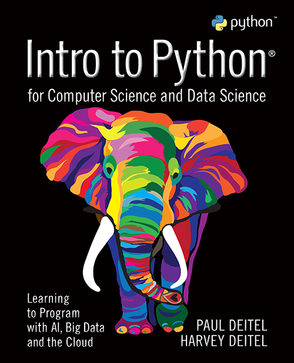
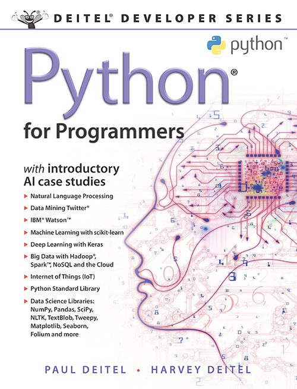

©️ Copyright 2026 by Deitel & Associates, Inc. and Pearson Education, Inc. All Rights Reserved. 

# PythonDataScienceFullThrottle2e
This is the repository for my  **Python Data Science Full Throttle: Introductory Artificial Intelligence (AI), Big Data and Cloud Case Studies** live training on O'Reilly Online Learning
https://learning.oreilly.com/live-events/python-data-science-ai-full-throttle-with-paul-deitel-introductory-ai-big-data-cloud-genai-case-studies/0642572313494/0642572313487/

We're working on the second editions of our Python books and videos now. Early access to some of those new materials will be available to you through this course and eventually my Python Fundamentals LiveLessons Sneak Peek. We're updating the videos in place in the current product at: https://learning.oreilly.com/course/python-fundamentals-with/9780135917411/

# Getting the Code
Download or clone this repository's contents onto your system. **These files are for your personal use and may not be redistributed or reposted.**

# Running the Code
If you want to run the code, keep in mind that various examples require API keys that you'll need to acquire and add to the files. The notebooks indicate which keys you need and where to get them.

## `pydsft` — Local Conda Environment Setup
This folder contains conda environment definitions and setup scripts for running the notebooks locally. There are two configurations:

| File | Platform |
|------|----------|
| `environment-mac-arm.yml` | Apple Silicon (M1/M2/M3/M4) |
| `environment-win-x64.yml` | Windows x86-64 |
| `setup-mac-arm.sh` | Mac ARM setup script |
| `setup-win-x64.ps1` | Windows x64 setup script |

The setup scripts are the recommended way to install. They create the conda environment from the appropriate `.yml` file, then automatically run all required post-install steps (spaCy models, TextBlob corpora, NLTK data).

### Prerequisites

- **Conda** — [Anaconda](https://www.anaconda.com/download) or
  [Miniconda](https://docs.conda.io/en/latest/miniconda.html)
- **Git** — required by pip to install any packages directly from GitHub
- **Mac ARM only:** Xcode Command Line Tools — run `xcode-select --install`
  if you have not done so already

### Mac ARM (Apple Silicon) Setup

Open a Terminal and run:

```bash
bash setup-mac-arm.sh
```

The script will:

1. Create (or update) the `pydsft` conda environment from `environment-mac-arm.yml`
2. Download the three spaCy English models (`sm`, `md`, `lg`)
3. Download the TextBlob corpora
4. Download the NLTK datasets (`punkt`, `punkt_tab`, `wordnet`, `stopwords`)
5. Run a smoke test confirming scikit-learn, TensorFlow, PySpark, and spaCy all import correctly

Once complete, activate the environment and launch JupyterLab:

```bash
conda activate pydsft
jupyter lab
```

### Windows x64 Setup

Open an **Anaconda PowerShell Prompt** and run:

```powershell
.\setup-win-x64.ps1
```

If you see an execution policy error, run this once first, then retry:

```powershell
Set-ExecutionPolicy -Scope CurrentUser -ExecutionPolicy RemoteSigned
```

The script performs the same steps as the Mac script (see above).

Once complete, activate the environment and launch JupyterLab:

```powershell
conda activate pydsft
jupyter lab
```

# Questions
If you have any questions, open an issue in the Issues tab or email us: deitel at deitel dot com.

# Our Videos/Books on Which These Examples Are Based 
**\[NEW EDITIONS UNDER DEVELOPMENT\]**
The content of this course is based on our book <a href=https://amzn.to/2Kd8dQk target="_blank">Python for Programmers</a>, which is a subset of our book <a href=https://amzn.to/2KfCptN target="_blank">Intro to Python for Computer Science and Data Science: Learning to Program with AI, Big Data and the Cloud.</a> 
   
<div style="float: left; padding-right:10px;text-align:center"><a href="https://learning.oreilly.com/videos/python-fundamentals/9780135917411"></a></br>50+ hours of in-depth videos</div>
    <div style="float: left; padding-right:10px;text-align:center"><a href="https://learning.oreilly.com/library/view/intro-to-python/9780135404799/"></a><br/><a href="https://amzn.to/2LiDCmt">Buy on Amazon</a></div></div>
    <div style="float: left; padding-right:10px;text-align:center"><a href="https://learning.oreilly.com/library/view/python-for-programmers/9780135231364"></a><br/><a href="https://amzn.to/2VvdnxE">Buy on Amazon</a></div>

The authors and publisher of this material have used their best efforts in preparing this material. These efforts include the development, research, and testing of the theories and programs to determine their effectiveness. The authors and publisher make no warranty of any kind, expressed or implied, with regard to these programs or to the documentation contained in this material. The authors and publisher shall not be liable in any event for incidental or consequential damages in connection with, or arising out of, the furnishing, performance, or use of these programs.
